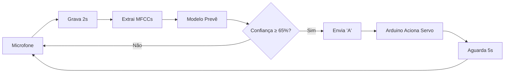

# 🐾 FoodPet - Alimentador Inteligente com Reconhecimento de Voz

Sistema de alimentação automatizada para pets controlado por comandos de voz, utilizando Arduino e Machine Learning.

## 🤖 Alunos

- Arthur Gonçalves Figuerôa
- Carlos Fábio Cabral Pinheiro
- Elcio José Ferreira da Silva
- Elynne Silva de Lima
- Giovanna Priscilla da Silva Lima
- Italo Cézar de Aquino Verçoza
- Maria Gabrielle Silva de Melo
- Thiago Henrique Freitas de Melo


## 📋 Índice

- [Visão Geral](#visão-geral)
- [Hardware](#hardware)
- [Estrutura do Projeto](#estrutura-do-projeto)
- [Instalação](#instalação)
- [Como Usar](#como-usar)
- [Como Funciona](#como-funciona)

## 🎯 Visão Geral

O **FoodPet** é um alimentador automático que reconhece comandos de voz em português ("alimente" e "servir") e aciona um servo motor via Arduino para liberar a ração. O sistema utiliza:

- **Machine Learning** (RandomForestClassifier) para reconhecimento de voz
- **Extração de features de áudio** (MFCCs) com librosa
- **Comunicação serial** (Python ↔ Arduino) via PySerial
- **Hardware Arduino** com servo motor para controle físico

## 🔧 Hardware

### Componentes Necessários

- **Arduino Uno R3**
- **Servo Motor MG90**
- **Jumpers Macho/Macho**
- **Cabo USB** (para conexão Arduino ↔ PC)

### Montagem

A montagem do servo é simples:

| Fio do Servo | Conexão no Arduino |
|--------------|-------------------|
| 🔴 Vermelho (VCC) | Pino **5V** |
| ⚫ Marrom/Preto (GND) | Pino **GND** |
| 🟠 Laranja/Amarelo (Sinal) | Pino **9** (PWM) |

### Código Arduino

Carregue o arquivo `food_pet.ino` na placa Arduino usando a IDE do Arduino. O código:

- Escuta comandos pela porta serial
- Quando recebe o caractere `'A'`, aciona o servo motor
- Move o servo de 0° (fechado) para 90° (aberto) por 1,5 segundos

## 📂 Estrutura do Projeto

```
FoodPet/
│
├── food_pet.ino              # Código do Arduino
├── main_app.py               # Aplicação principal (execução em tempo real)
├── requirements.txt          # Dependências Python
├── README.md                 # Este arquivo
│
└── src/
    ├── data_collection.py    # Script para coletar áudios de treinamento
    ├── train_model.py        # Script para treinar o modelo de IA
    │
    ├── data/                 # Dados de treinamento (arquivos .wav)
    │   ├── alimente/         # Amostras do comando "alimente"
    │   ├── servir/           # Amostras do comando "servir"
    │   └── background_noise/ # Amostras de ruído ambiente
    │
    └── model/                # Modelos treinados (gerados automaticamente)
        ├── pet_feeder_model.pkl
        └── labels_map.pkl
```

## 🚀 Instalação

### 1. Dependências Python

Instale as bibliotecas necessárias:

```bash
pip install -r requirements.txt
```

**Bibliotecas incluídas:**
- `numpy` - Manipulação de arrays
- `scikit-learn` - Machine Learning (RandomForest)
- `pyserial` - Comunicação serial com Arduino
- `librosa` - Processamento de áudio e extração de MFCCs
- `sounddevice` - Gravação de áudio em tempo real
- `soundfile` - Salvamento de arquivos .wav
- `joblib` - Serialização de modelos

### 2. Arduino IDE

- Baixe a [Arduino IDE](https://www.arduino.cc/en/software)
- Carregue o arquivo `food_pet.ino` na sua placa
- Verifique a porta COM no menu **Ferramentas → Porta**

## 🎮 Como Usar

### Passo 1: Coletar Dados de Treinamento

Execute o script de coleta de dados para gravar amostras de áudio:

```bash
python src/data_collection.py
```

**O que faz:**
- Grava **20 amostras** de cada comando (2 segundos cada)
- Salva os arquivos `.wav` em `src/data/`
- Comandos: `"alimente"`, `"servir"`, `"background_noise"` (silêncio/ruído)

**Dicas:**
- Grave em um ambiente silencioso
- Varie a entonação e volume
- Para `background_noise`, deixe o microfone capturar ruído ambiente

### Passo 2: Treinar o Modelo

Execute o script de treinamento:

```bash
python src/train_model.py
```

**O que faz:**
- Carrega os áudios de `src/data/`
- Extrai **MFCCs** (Mel-Frequency Cepstral Coefficients) de cada áudio
- Treina um **RandomForestClassifier** (100 árvores)
- Divide em 80% treino / 20% teste
- Salva o modelo treinado em `src/model/`
- Exibe a **acurácia** no terminal

**Exemplo de saída:**
```
Carregando dados das classes: ['alimente', 'servir', 'background_noise']
Total de 60 amostras carregadas.

Iniciando treinamento do modelo (RandomForest)...
Treinamento concluído.

Acurácia do modelo no set de teste: 95.00%

Modelo salvo em: src/model/pet_feeder_model.pkl
Mapa de labels salvo em: src/model/labels_map.pkl
```

### Passo 3: Executar o Sistema

**⚠️ Antes de executar:**
1. Conecte o Arduino ao computador
2. Verifique a porta COM no código (`main_app.py`, linha 12)
3. Certifique-se de que o modelo foi treinado (Passo 2)

Execute a aplicação principal:

```bash
python main_app.py
```

**O que faz:**
- Carrega o modelo treinado
- Conecta ao Arduino via porta serial
- Escuta o microfone em tempo real (loop infinito)
- Quando detecta `"alimente"` ou `"servir"` com confiança ≥ 65%:
  - Envia o caractere `'A'` para o Arduino
  - Arduino aciona o servo motor
  - Aguarda 5 segundos antes de aceitar novo comando

**Exemplo de saída:**
```
Tentando conectar em COM3 a 9600...
Conexão com Arduino estabelecida.

--- Alimentador Pet ATIVADO ---
Ouvindo... Diga 'alimente' ou 'servir'. (Ctrl+C para sair)

Detectado: 'background_noise' (Confiança: 0.82)
Detectado: 'alimente' (Confiança: 0.91)
=== COMANDO RECONHECIDO: alimente ===
Enviando sinal 'A' para o Arduino...
Comando enviado. Aguardando 5s...

Pronto para ouvir novamente.
```

**Para sair:** Pressione `Ctrl+C`

## 🧠 Como Funciona

### 1. Coleta de Dados (`data_collection.py`)

- Grava áudios de 2 segundos via microfone
- Salva em formato `.wav` a 22050 Hz (taxa de amostragem padrão)
- Organiza por classe (comando) em subpastas

### 2. Treinamento do Modelo (`train_model.py`)

#### Extração de Features
```python
mfccs = librosa.feature.mfcc(y=audio, sr=sr, n_mfcc=13)
mfccs_mean = np.mean(mfccs.T, axis=0)
```
- **MFCCs** são a "impressão digital" do som
- Representam as características espectrais do áudio
- Usamos a média de 13 coeficientes para um vetor de tamanho fixo

#### Modelo RandomForest
```python
model = RandomForestClassifier(n_estimators=100, random_state=42)
```
- **Ensemble de 100 árvores de decisão**
- Cada árvore "vota" na classe mais provável
- Robusto a ruído e overfitting
- Não requer normalização dos dados

### 3. Aplicação em Tempo Real (`main_app.py`)

#### Fluxo de Execução



#### Limiar de Confiança
```python
CONFIDENCE_THRESHOLD = 0.65  # 65%
```
- Evita falsos positivos (comandos não intencionais)
- Ajustável conforme a qualidade do modelo

### 4. Comunicação Serial

**Python → Arduino:**
```python
arduino_ser.write(b'A')  # Envia byte 'A'
```

**Arduino recebe:**
```cpp
char comando = Serial.read();
if (comando == 'A') {
    servirRacao();
}
```

## 🎓 Conceitos de IA Aplicados

### RandomForestClassifier
- **Tipo:** Ensemble Learning (Aprendizado em Conjunto)
- **Base:** Múltiplas Árvores de Decisão
- **Técnica:** Bagging + Randomização de Features
- **Vantagem:** Robusto, não sofre overfitting facilmente

### MFCCs (Mel-Frequency Cepstral Coefficients)
- **Uso:** Representação compacta de áudio
- **Inspiração:** Sistema auditivo humano (escala Mel)
- **Output:** 13 coeficientes que capturam timbre e entonação

### Train-Test Split
- **80% Treino:** Dados que o modelo "estuda"
- **20% Teste:** Dados nunca vistos (validação real da acurácia)

## ⚙️ Configurações Personalizáveis

### `main_app.py`
```python
SERIAL_PORT = "COM3"            # Porta do Arduino (Windows: COM3, Linux: /dev/ttyUSB0)
BAUD_RATE = 9600                # Velocidade da comunicação serial
SAMPLE_RATE = 22050             # Taxa de amostragem de áudio (Hz)
DURATION = 2                    # Duração da gravação (segundos)
CONFIDENCE_THRESHOLD = 0.65     # Limiar de confiança (0-1)
```

### `train_model.py`
```python
n_estimators=100                # Número de árvores no RandomForest
test_size=0.2                   # Proporção do conjunto de teste (20%)
n_mfcc=13                       # Número de coeficientes MFCCs
```

### `food_pet.ino`
```cpp
const int anguloFechado = 0;    // Ângulo inicial do servo
const int anguloAberto = 90;    // Ângulo para liberar ração
delay(1500);                    // Tempo que o servo fica aberto (ms)
```

## 🐛 Troubleshooting

### Erro: "Porta COM não encontrada"
- ✅ Verifique se o Arduino está conectado via USB
- ✅ Confira a porta no Arduino IDE: **Ferramentas → Porta**
- ✅ Altere `SERIAL_PORT` em `main_app.py`
- ✅ Feche a Arduino IDE (ela bloqueia a porta)

### Baixa Acurácia (< 80%)
- ✅ Grave mais amostras (30-50 por comando)
- ✅ Varie entonação, volume e distância do microfone
- ✅ Grave em ambiente mais silencioso
- ✅ Aumente `n_estimators` para 200+

### Falsos Positivos Frequentes
- ✅ Aumente `CONFIDENCE_THRESHOLD` (ex: 0.80)
- ✅ Grave mais amostras de `background_noise`
- ✅ Reduza ruído do ambiente durante uso

### Arduino Não Responde
- ✅ Verifique se `food_pet.ino` foi carregado corretamente
- ✅ Teste a comunicação serial na Arduino IDE (Serial Monitor)
- ✅ Confirme se `BAUD_RATE` é 9600 em ambos os códigos

## 🚀 Melhorias Futuras

- [ ] Adicionar mais comandos ("pare", "limpe", "horário")
- [ ] Implementar Deep Learning (CNN ou RNN) para melhor acurácia
- [ ] Criar interface web/mobile para controle remoto
- [ ] Adicionar sensor de nível de ração
- [ ] Agendar horários automáticos de alimentação
- [ ] Suporte a múltiplos idiomas
